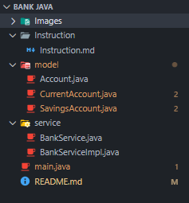

# 💰 Bank CLI – Java Console Application

## 📌 Description
**Bank CLI** is a simple command-line banking application developed in **Java**.  
The project is designed to practice and revise **Java fundamentals** and **Object-Oriented Programming (OOP)** concepts through a concrete and structured example.

The application allows users to manage bank accounts, perform deposits and withdrawals, and display account information using a console-based menu.

---

## 🎯 Learning Objectives
This project focuses on:
- Java basics
- Object-Oriented Programming (OOP)
- Classes and objects
- Inheritance (`extends`)
- Interfaces and implementation (`implements`)
- Polymorphism
- Encapsulation
- User input handling with `Scanner`
- Collections (`List`, `Map`)
- Basic CLI menu navigation

---

## ⚙️ Features
- Create savings and current accounts
- Deposit money
- Withdraw money with validation
- Apply interest rate logic
- Display account details
- Handle invalid operations (amount ≤ 0, insufficient balance)
- Interactive menu in the console

---

## 🏗️ Project Structure

## 🚧 Project Status
- Work in progress (WIP)
This project is still under development.
New features, refactoring, and improvements will be added progressively.

## 👨‍💻 Contributors
- Ilyas Sekhsoukhi  
- Mohammed-Amine Elboukbiri